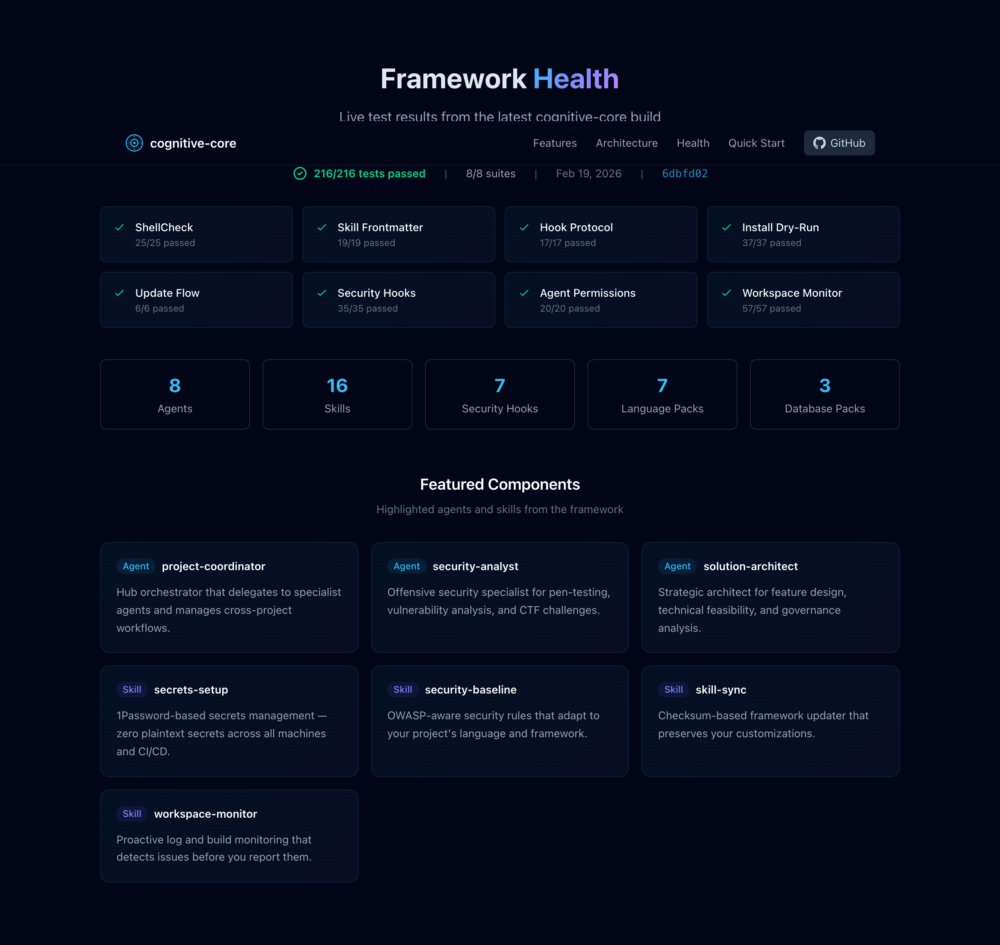

# cognitive-core

[](https://multivac42.ai)
[](LICENSE)
[](https://github.com/mindcockpit-ai/cognitive-core)

A portable framework that installs production-grade hooks, agents, skills, CI/CD pipelines, and monitoring into any Claude Code project in under 60 seconds.

## Feature Highlights

- **Hooks** -- 8 event hooks: session startup, bash/read/write/fetch validation, post-edit linting, compaction reminders
- **Agents** -- Hub-and-spoke team of 8 specialists (coordinator, architect, reviewer, tester, researcher, database, security, updater)
- **Skills** -- 18 reusable skills from session-resume to secrets-setup, with language and database packs
- **Secrets** -- 1Password / macOS Keychain backends with `secrets-run` injection, `secrets-store` CLI, and `secrets-setup` skill
- **CI/CD** -- Evolutionary pipeline with fitness gates, self-hosted runner setup, GitHub Actions workflows
- **Monitoring** -- Prometheus, Grafana dashboards, Alertmanager with Slack/email/PagerDuty
- **Kubernetes** -- Base manifests, Kustomize overlays, monitoring stack for horizontal scaling
- **Marketplace** -- Community component marketplace ([cognitive-core-marketplace](https://github.com/mindcockpit-ai/cognitive-core-marketplace)) for sharing agents, skills, hooks, and packs
- **Checksum updater** -- Safe framework updates that preserve your customizations

## Quick Start

```bash
# 1. Clone the framework
git clone https://github.com/mindcockpit-ai/cognitive-core.git
cd cognitive-core

# 2. Install into your project (interactive setup)
./install.sh /path/to/your-project

# 3. Start a Claude Code session -- hooks load automatically
cd /path/to/your-project && claude
```

## Architecture

```
cognitive-core/                         Your project after install:
+-- core/                               .claude/
|   +-- hooks/                            +-- hooks/
|   |   +-- _lib.sh          -------->    |   +-- _lib.sh
|   |   +-- setup-env.sh     -------->    |   +-- setup-env.sh
|   |   +-- validate-bash.sh -------->    |   +-- validate-bash.sh
|   |   +-- post-edit-lint.sh-------->    |   +-- post-edit-lint.sh
|   |   +-- compact-reminder.sh------>    |   +-- compact-reminder.sh
|   +-- agents/                           +-- agents/
|   |   +-- project-coordinator.md--->    |   +-- project-coordinator.md
|   |   +-- code-standards-reviewer-->    |   +-- code-standards-reviewer.md
|   |   +-- solution-architect.md---->    |   +-- solution-architect.md
|   |   +-- test-specialist.md------->    |   +-- test-specialist.md
|   |   +-- research-analyst.md------>    |   +-- research-analyst.md
|   |   +-- database-specialist.md--->    |   +-- database-specialist.md
|   +-- skills/                           +-- skills/
|   |   +-- session-resume/ --------->    |   +-- session-resume/
|   |   +-- code-review/   --------->    |   +-- code-review/
|   |   +-- pre-commit/    --------->    |   +-- pre-commit/
|   |   +-- fitness/        --------->    |   +-- fitness/
|   |   +-- ...                           |   +-- ...
|   +-- templates/                        +-- settings.json
|   +-- utilities/                        +-- cognitive-core/
+-- language-packs/                       |   +-- version.json
|   +-- perl/, python/, node/             +-- AGENTS_README.md
|   +-- java/, go/, rust/, csharp/    CLAUDE.md
+-- database-packs/                   cognitive-core.conf
|   +-- oracle/, postgresql/, mysql/
+-- cicd/
|   +-- workflows/
|   +-- docker/
|   +-- scripts/
|   +-- monitoring/
|   +-- k8s/
+-- install.sh
+-- update.sh
+-- cognitive-core.conf.example
```

## Framework Health

Live test results and component inventory from the latest build, visible at [multivac42.ai/#health](https://multivac42.ai/#health).



## What's Included

### Hooks

| Hook | Event | Purpose |
|------|-------|---------|
| `setup-env.sh` | SessionStart | Sets environment variables, verifies hook integrity, prints branch status |
| `validate-bash.sh` | PreToolUse (Bash) | Blocks dangerous commands (rm -rf /, force push to main, exfiltration) |
| `validate-read.sh` | PreToolUse (Read) | Prevents reading sensitive system files (SSH keys, /etc/shadow) |
| `validate-fetch.sh` | PreToolUse (WebFetch/WebSearch) | Audits URLs, domain filtering, security logging |
| `validate-write.sh` | PostToolUse (Write/Edit) | Scans for hardcoded secrets (AWS keys, PEM, API tokens) |
| `post-edit-lint.sh` | PostToolUse (Edit/Write) | Runs lint on every file edit automatically |
| `compact-reminder.sh` | Notification (compact) | Re-injects critical rules after context compaction |
| `_lib.sh` | (shared) | Config loading, JSON output helpers for all hooks |

### Agents

| Agent | Model | Role |
|-------|-------|------|
| project-coordinator | opus | Hub orchestrator -- analyzes requests and delegates |
| solution-architect | opus | Business workflows, architecture, requirements |
| code-standards-reviewer | sonnet | Code review against CLAUDE.md standards |
| test-specialist | sonnet | Unit/integration tests, coverage, QA |
| research-analyst | opus | External research, library evaluation |
| database-specialist | opus | Query optimization, bulk operations, schema design |
| security-analyst | opus | Vulnerability analysis, CTF methodology, forensics |
| skill-updater | sonnet | Framework synchronization, component updates |

### Skills

| Skill | Auto-load | Purpose |
|-------|-----------|---------|
| session-resume | yes | Recovers context at session start |
| code-review | yes | Structured code review checklist |
| tech-intel | yes | Technology intelligence and research |
| security-baseline | yes | OWASP-aware secure coding rules |
| session-sync | manual | Cross-machine session synchronization |
| skill-sync | manual | Framework skill synchronization and updates |
| pre-commit | manual | Pre-commit validation checks |
| fitness | manual | Codebase fitness scoring |
| project-status | manual | Project status dashboard |
| project-board | manual | GitHub Project board management with closure guard, auto-branch, auto-sprint |
| workspace-monitor | manual | Proactive log, test, and build monitoring |
| workflow-analysis | manual | Workflow and process analysis |
| test-scaffold | manual | Test file generation from source |
| secrets-setup | manual | 1Password / Keychain secrets management setup |
| acceptance-verification | manual | GitHub issue acceptance criteria checker with auto-tick on PASS |
| smoke-test | manual | Playwright endpoint smoke tests after deployment |
| lint-debt | manual | Track and reduce lint debt across the codebase |
| ctf-pentesting | manual | CTF challenge methodology and kill chain |

## Configuration

All configuration lives in a single `cognitive-core.conf` file (shell syntax, sourced by hooks at runtime).

```bash
# Key configuration sections:
CC_PROJECT_NAME="my-project"      # Project identity
CC_LANGUAGE="python"               # perl|python|node|java|go|rust|csharp
CC_DATABASE="postgresql"           # oracle|postgresql|mysql|sqlite|none
CC_ARCHITECTURE="ddd"             # ddd|mvc|clean|hexagonal|layered|none
CC_AGENTS="coordinator reviewer"   # Which agents to install
CC_SKILLS="session-resume ..."     # Which skills to install
CC_HOOKS="setup-env ..."           # Which hooks to enable
CC_ENABLE_CICD="true"             # Install CI/CD pipeline
CC_MONITORING="true"              # Install monitoring stack
```

See `cognitive-core.conf.example` for the complete reference with all options.

## Language Packs

Language packs add language-specific skills and patterns.

| Language | Pack | Skills Included |
|----------|------|-----------------|
| Perl | `language-packs/perl/` | perl-patterns |
| Python | `language-packs/python/` | python-patterns |
| Node.js | `language-packs/node/` | node-messaging |
| Java | `language-packs/java/` | java-messaging |
| Go | `language-packs/go/` | go-messaging |
| Rust | `language-packs/rust/` | rust-messaging |
| C# | `language-packs/csharp/` | csharp-messaging |

### Database Packs

| Database | Pack | Skills Included |
|----------|------|-----------------|
| Oracle | `database-packs/oracle/` | oracle-patterns |
| PostgreSQL | `database-packs/postgresql/` | pack.conf only (skills planned) |
| MySQL | `database-packs/mysql/` | pack.conf only (skills planned) |

## CI/CD Pipeline

The evolutionary CI/CD pipeline gates deployments on codebase fitness scores.

```
  Commit  --->  Lint Gate (60%)  --->  Test Gate (85%)  --->  Merge Gate (90%)
                     |                      |                       |
                 fitness-check.sh      fitness-check.sh       fitness-check.sh
                     |                      |                       |
                push-metrics.sh -----> Prometheus -----> Grafana Dashboards
                                                              |
                                                        Alert Rules
                                                       /     |      \
                                                 Slack   Email   PagerDuty
```

### Included Components

- **GitHub Actions** -- `lint.yml` and `evolutionary-cicd.yml` workflows
- **Docker** -- Runner Dockerfile, compose files for runners and monitoring
- **Scripts** -- `setup-runner.sh`, `fitness-check.sh`, `push-metrics.sh`
- **Monitoring** -- Prometheus config, Grafana dashboards (CI/CD overview, app metrics), Alertmanager
- **Kubernetes** -- Base manifests, Kustomize overlays, monitoring manifests

### Fitness Gates

Configurable thresholds that increase strictness as code moves toward production:

| Gate | Default | When |
|------|---------|------|
| Lint | 60% | Every commit |
| Commit | 80% | Commit message quality |
| Test | 85% | Test coverage |
| Merge | 90% | Pull request merge |
| Deploy | 95% | Production deployment |

## Horizontal Scaling

For teams running multiple CI/CD runners:

```bash
# In cognitive-core.conf
CC_RUNNER_NODES="3"
CC_RUNNER_LABELS="self-hosted,linux,docker"
```

The `setup-runner.sh` script provisions self-hosted GitHub Actions runners with Docker-in-Docker support. Scale horizontally by running the setup on additional VPS nodes.

## Updating

The `update.sh` script safely updates framework files while preserving your customizations:

```bash
# Pull latest framework
cd /path/to/cognitive-core && git pull

# Update your project
./update.sh /path/to/your-project
```

The updater:
1. Reads the version manifest to identify tracked files
2. Computes checksums of installed files vs. originals
3. Updates files you have not modified
4. Preserves files you have customized (warns you to review manually)
5. Installs new framework files added since your last install
6. Writes an updated version manifest

## Design Decisions

This framework was built from 21 findings identified during a comprehensive CI/CD and developer-experience audit. Key resolutions:

| # | Finding | Resolution |
|---|---------|------------|
| 1 | Hook reliability | Shared `_lib.sh` with JSON helpers, `set -euo pipefail` everywhere |
| 2 | Config sprawl | Single `cognitive-core.conf` sourced by all hooks |
| 3 | Agent coordination | Hub-and-spoke model with mandatory quality gate |
| 4 | Skill bloat | Progressive disclosure: SKILL.md + references/ subdirectory |
| 5 | Context budget | Auto-load estimation, size warnings in health checks |
| 6 | Docker socket security | Externalized `DOCKER_GID` in .env, not hardcoded |
| 7 | Credential management | `secrets-run` + `secrets-store` with 1Password / macOS Keychain backends, `.env.tpl` with `op://` references |
| 8 | Cross-platform | macOS + Linux support in all scripts |
| 9 | Update safety | Checksum-based updater preserves user modifications |
| 10 | Fitness scoring | Configurable per-gate thresholds |
| 11 | Horizontal scaling | Multi-node runner provisioning |
| 12 | Monitoring | Prometheus + Grafana + Alertmanager with multi-channel alerts |
| 13 | Language agnostic | Language packs with per-language skills and patterns |
| 14 | Database agnostic | Database packs with per-database skills and patterns |
| 15 | Secrets in config | Credentials managed via `secrets-setup` skill (scan, init, patch-ci), injected at runtime via `secrets-run` |
| 16 | Pushgateway exposure | Localhost-only binding by default |
| 17 | Interactive install | Guided setup with sane defaults for every option |
| 18 | Bash validation | PreToolUse hook blocks dangerous commands |
| 19 | Compaction survival | Critical rules re-injected after context compaction |
| 20 | Session continuity | session-resume skill with live context injection |
| 21 | Version tracking | Manifest with file checksums for safe updates |

## Marketplace

The [cognitive-core-marketplace](https://github.com/mindcockpit-ai/cognitive-core-marketplace) is a community platform for sharing and discovering agents, skills, hooks, and packs built with cognitive-core.

- **Stack**: FastAPI + SQLAlchemy 2.0 async + PostgreSQL (DDD architecture)
- **API**: REST at `marketplace.mindcockpit.ai/api/v1/`
- **Features**: Component publishing, search, ratings, author profiles, semantic versioning
- **Deployment**: 3-stage K8s pipeline (dev/staging/production) on the same VPS infrastructure

## Contributing

1. Fork the repository
2. Create a feature branch: `git checkout -b feat/my-feature`
3. Make your changes following the conventional commit format
4. Test the install flow: `./install.sh /tmp/test-project`
5. Test the update flow: `./update.sh /tmp/test-project`
6. Submit a pull request

### Project Structure

```
core/           Framework core (hooks, agents, skills, templates, utilities)
language-packs/ Language-specific extensions (perl, python, node, ...)
database-packs/ Database-specific extensions (oracle, postgresql, mysql)
cicd/           CI/CD pipeline (workflows, docker, scripts, monitoring, k8s)
docs/           Framework documentation
install.sh      Interactive bootstrapper
update.sh       Checksum-based updater
```

### Adding a Language Pack

1. Create `language-packs/<language>/skills/<skill-name>/SKILL.md`
2. Add language defaults to the install.sh `case` statement
3. Test: `./install.sh /tmp/test --force` with `CC_LANGUAGE=<language>`

### Adding a Database Pack

1. Create `database-packs/<database>/skills/<skill-name>/SKILL.md`
2. Test: `./install.sh /tmp/test --force` with `CC_DATABASE=<database>`

## Links

- **Website**: [multivac42.ai](https://multivac42.ai)
- **GitHub**: [mindcockpit-ai/cognitive-core](https://github.com/mindcockpit-ai/cognitive-core)
- **Docs**: [docs/](docs/)

## License

MIT License. See [LICENSE](LICENSE) for details.
