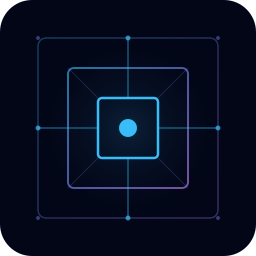
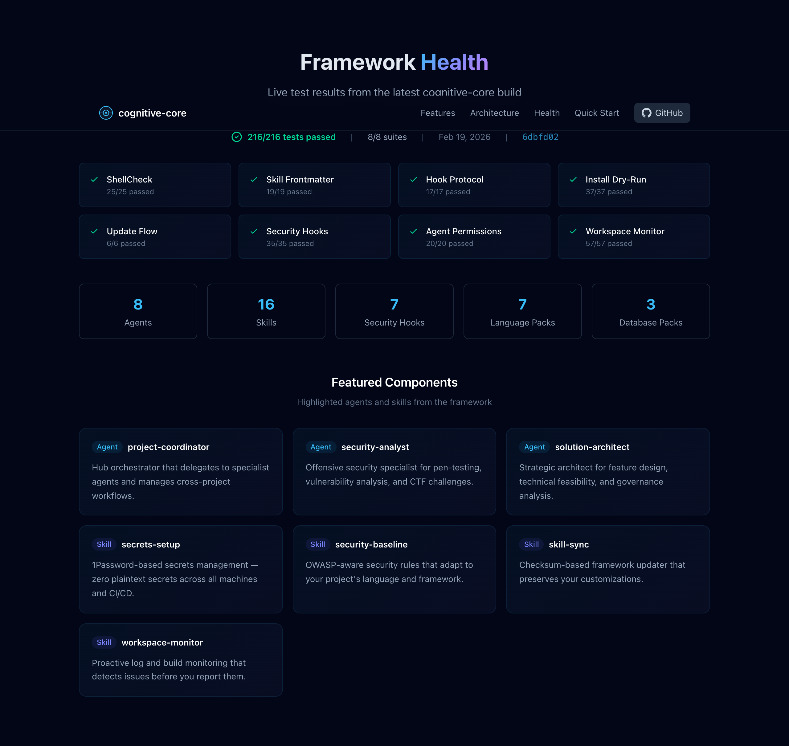

<p align="center">
  
</p>

<h1 align="center">cognitive-core</h1>

<p align="center">
  <a href="https://multivac42.ai"></a>
  <a href="LICENSE"></a>
  <a href="https://github.com/mindcockpit-ai/cognitive-core"></a>
</p>

<p align="center">A portable framework that installs production-grade hooks, agents, skills, CI/CD pipelines, and monitoring into any Claude Code project in under 60 seconds.</p>

<p align="center"><em>Born abilities from day one. Learned abilities from experience.<br/>Nature's teamwork, applied to AI agents.</em></p>

## Philosophy

> **Why a forest, not a factory**
>
> A forest has no CEO — yet it has thrived for 400 million years.
> Every organism arrives with born abilities: reflexes that protect,
> senses that monitor, an immune system that defends. No training needed.
> But with experience, it grows — learning, adapting, cooperating.
>
> We build software the old way: one mind, one task, alone.
> Nature solved this long ago.
>
> **cognitive-core** gives every project born abilities from its first
> install — reflexes that block danger, sensors that monitor actions,
> an immune system that catches threats. And with experience, it grows:
> agents learn, skills evolve, code is naturally selected.
>
> We didn't invent these patterns. Evolution did.
> We applied them to how AI agents work together.

### The Parsimony Principle

> *A forest wastes nothing. Every leaf is sized to capture exactly the light
> it needs. Every root extends only as far as the water demands. Evolution
> is the original Occam's Razor — ruthlessly selecting the simplest design
> that works.*

cognitive-core applies this same parsimony:

| Nature | cognitive-core | Principle |
|--------|---------------|-----------|
| Neural sparsity (1-15% activation) | Activate only the agents a task requires | Minimal orchestration |
| Metabolic optimization | Request only the tools a skill cannot function without | Minimal tool sets |
| Walk/run energy transition | Use the least restrictive response that achieves safety | Graduated hooks |
| Streamlined body plans | Prefer the simplest design that meets requirements | Architectural parsimony |
| Simplest-path foraging | Test the simplest hypothesis first | Problem-solving efficiency |

Complexity is not forbidden — it must be *justified*. Essential complexity
(inherent to the problem) is respected. Accidental complexity (introduced
by the solution) is eliminated.

**Exception: security.** Defense-in-depth requires intentional redundancy
across layers. Parsimony applies *within* each security layer, never *across* them.

## Who Is This For?

| Audience | What You Get |
|----------|-------------|
| **Solo developers** using Claude Code | Production-grade safety hooks, structured agents, and skills from first install |
| **Development teams** adopting AI-assisted workflows | Consistent coding standards, CI/CD fitness gates, multi-agent coordination |
| **Enterprise architects** | Portable framework across 11 languages, 3 database packs, 3 platform adapters |
| **Security-conscious organizations** | Defense-in-depth hooks that block dangerous commands, scan for secrets, audit external access |

**Complements** (not replaces): Documentation tools like [Context7](https://context7.com) provide library docs — cognitive-core provides workflow safety, agent teams, and quality enforcement.

## Why cognitive-core?

| | Traditional IDE AI | Cloud SaaS Tools | cognitive-core |
|---|---|---|---|
| **Deployment** | Locked to one IDE | Cloud-dependent | Installs into any project |
| **AI Provider** | Single vendor | Single vendor | Multi-adapter (Claude, Ollama, IntelliJ) |
| **Data Sovereignty** | Cloud required | Cloud required | Fully local possible |
| **Project Management** | None | None | GitHub, Jira, YouTrack |
| **Legacy Support** | Generic | Generic | Struts/JSP, legacy Java archeology |
| **Customization** | Extensions/plugins | None | Create skills, rules, agents |
| **Governance** | Optional | Optional | Human Approval Gate (architectural principle) |
| **Language** | English only | English only | Any language the model supports |
| **License** | Proprietary | Proprietary | Fair Source (FSL-1.1-ALv2) |
| **Source Code** | Not accessible | Not accessible | Publicly auditable |

## Self-Evolving Framework

cognitive-core is not a static product you install and use "as is." Like a living organism, it evolves with every deployment:

- **Every prompt** refines agent behavior
- **Every resolved issue** generates domain knowledge
- **Every session** strengthens project-specific patterns

We don't have product managers — we have cognitive-core. Every idea is evaluated immediately. What survives evolution, stays. What doesn't add value, naturally fades.

Multi-agent peer review — where agents check each other's work — was implemented in cognitive-core before Anthropic officially added it to their tools.

### Born Abilities (work from first install)

| Nature | cognitive-core | What it does |
|--------|---------------|-------------|
| Pain reflex | `validate-bash.sh` | Blocks `rm -rf /`, force-push to main, DROP TABLE — before execution |
| Toxin detection | `validate-write.sh` | Catches hardcoded secrets (AWS keys, API tokens) in written files |
| Boundary defense | `validate-read.sh` | Prevents reading SSH keys, credentials, system files |
| Environmental sensing | `validate-fetch.sh` | Audits external URLs, filters unknown domains |
| Sleep memory | `compact-reminder.sh` | Re-injects critical rules after context compaction |
| Autonomic system | `setup-env.sh` | Sets environment, verifies integrity — every session |
| Proprioception | `post-edit-lint.sh` | Runs lint immediately after every file edit |

### Learned Abilities (grow with experience)

| Nature | cognitive-core | What it does |
|--------|---------------|-------------|
| Skill acquisition | `/skill-sync` | Absorb new capabilities from the framework |
| Immune memory | Security logging | Remember and respond faster to known threats |
| Evolution | `update.sh` | Safe mutation propagation — preserves your adaptations |
| Natural selection | Evolutionary CI/CD | 5 fitness gates ensure only the strongest code survives |
| Cooperation | Symbiotic Cortex | Specialized agents working together through parallel and focused paths |

## Feature Highlights

- **Hooks** -- 9 event hooks: session startup, bash/read/write/fetch validation, post-edit linting, compaction reminders, Angular and Spring Boot version guards
- **Agents** -- Hub-and-spoke team of 10 specialists (coordinator, architect, reviewer, tester, researcher, database, security, updater, Angular specialist, Spring Boot specialist)
- **Skills** -- 43 reusable skills: 19 core (session-resume to e2e-visual-regression) plus 24 language and database pack skills
- **Secrets** -- 1Password / macOS Keychain backends with `secrets-run` injection, `secrets-store` CLI, and `secrets-setup` skill
- **CI/CD** -- Evolutionary pipeline with fitness gates, self-hosted runner setup, GitHub Actions workflows
- **Monitoring** -- Prometheus, Grafana dashboards, Alertmanager with Slack/email/PagerDuty
- **Kubernetes** -- Base manifests, Kustomize overlays, monitoring stack for horizontal scaling
- **Checksum updater** -- Safe framework updates that preserve your customizations

## Quick Start

### Option 1: Claude Code Plugin (Quick Start)

```bash
# Load the plugin — hooks, agents, and skills activate instantly
claude --plugin-dir https://github.com/mindcockpit-ai/cognitive-core/plugin

# Configure for your project
/setup
```

### Option 2: Full Install (CI/CD, Language Packs, Multi-Platform)

```bash
# 1. Clone the framework
git clone https://github.com/mindcockpit-ai/cognitive-core.git
cd cognitive-core

# 2. Install into your project (interactive setup)
./install.sh /path/to/your-project

# 3. Start a Claude Code session -- hooks load automatically
cd /path/to/your-project && claude
```

> **Both paths coexist.** If the plugin is already installed, `install.sh` detects it and skips hooks/agents/skills (provided by plugin), installing only CI/CD pipelines, language packs, and project configuration.

### Supported Platforms

| Platform | Install Method |
|----------|---------------|
| **Claude Code** | Plugin or install.sh |
| **Aider + Ollama** | `./install.sh --platform aider` |
| **IntelliJ / DevoxxGenie** | `./install.sh --platform intellij` |

### Local Development Testing

```bash
# Test the plugin from a local clone
claude --plugin-dir ./plugin
```

## Recipes

Step-by-step guides for common workflows:

| Recipe | Description |
|--------|-------------|
| [Getting Started — Java](docs/recipes/getting-started-java.md) | First 5 minutes with a Java/Spring Boot project |
| [Getting Started — Python](docs/recipes/getting-started-python.md) | First 5 minutes with a Python project |
| [Getting Started — Node.js](docs/recipes/getting-started-node.md) | First 5 minutes with a Node.js/React project |
| [Code Review](docs/recipes/recipe-code-review.md) | Run a code review with conventions |
| [Test Creation](docs/recipes/recipe-test-creation.md) | Create tests with @test-specialist |
| [Security Scan](docs/recipes/recipe-security-scan.md) | Scan for vulnerabilities |
| [Architecture Analysis](docs/recipes/recipe-architecture-analysis.md) | Analyze project architecture |
| [Coordinator Workflow](docs/recipes/recipe-coordinator-workflow.md) | Autonomous multi-agent workflow |
| [Wrong Agent?](docs/recipes/recipe-wrong-agent.md) | How agent redirect works |
| [Nothing Happened?](docs/recipes/recipe-no-output.md) | Common setup troubleshooting |

## Academic Foundation & EU Collaboration

cognitive-core is built on principles from evolutionary cognitive biology and behavioral ecology. Academic collaboration drives real results — peer-reviewed studies (RAFT by UC Berkeley/Microsoft/Meta, RAG-HAT from EMNLP 2024) show that RAG + finetuning reduces hallucination to 0-4%.

Current collaborations:
- **Hochschule Albstadt-Sigmaringen** — semester project with students
- **Brigadee** (EU startup) — using the framework for development
- **TZO startup TUKE Kosice** & **University of Veterinary Medicine Kosice** (PharmaSys project)

## Architecture

```
cognitive-core/                         Your project after install:
+-- core/                               .claude/
|   +-- hooks/                            +-- hooks/
|   |   +-- _lib.sh          -------->    |   +-- _lib.sh
|   |   +-- setup-env.sh     -------->    |   +-- setup-env.sh
|   |   +-- validate-bash.sh -------->    |   +-- validate-bash.sh
|   |   +-- post-edit-lint.sh-------->    |   +-- post-edit-lint.sh
|   |   +-- compact-reminder.sh------>    |   +-- compact-reminder.sh
|   +-- agents/                           +-- agents/
|   |   +-- project-coordinator.md--->    |   +-- project-coordinator.md
|   |   +-- code-standards-reviewer-->    |   +-- code-standards-reviewer.md
|   |   +-- solution-architect.md---->    |   +-- solution-architect.md
|   |   +-- test-specialist.md------->    |   +-- test-specialist.md
|   |   +-- research-analyst.md------>    |   +-- research-analyst.md
|   |   +-- database-specialist.md--->    |   +-- database-specialist.md
|   |   +-- angular-specialist.md---->    |   +-- angular-specialist.md
|   +-- skills/                           +-- skills/
|   |   +-- session-resume/ --------->    |   +-- session-resume/
|   |   +-- code-review/   --------->    |   +-- code-review/
|   |   +-- pre-commit/    --------->    |   +-- pre-commit/
|   |   +-- fitness/        --------->    |   +-- fitness/
|   |   +-- ...                           |   +-- ...
|   +-- templates/                        +-- rules/
|   |   +-- rules/testing.md  --------->  |   +-- testing.md
|   +-- utilities/                        |   +-- <language>-conventions.md
+-- language-packs/                       +-- settings.json
|   +-- perl/, python/, node/             +-- cognitive-core/
|   |   +-- rules/ (per-language)         |   +-- version.json
|   +-- java/, go/, rust/, csharp/        +-- AGENTS_README.md
|   +-- react/, angular/, spring-boot/ CLAUDE.md
|   +-- react/, angular/, spring-boot/
+-- adapters/
|   +-- claude/, aider/, intellij/
+-- database-packs/                   cognitive-core.conf
|   +-- oracle/, postgresql/, mysql/
+-- cicd/
|   +-- workflows/
|   +-- docker/
|   +-- scripts/
|   +-- monitoring/
|   +-- k8s/
+-- install.sh
+-- update.sh
+-- cognitive-core.conf.example
```

## Framework Health

Live test results and component inventory from the latest build, visible at [multivac42.ai/#health](https://multivac42.ai/#health).



## What's Included

### Hooks

| Hook | Event | Purpose |
|------|-------|---------|
| `setup-env.sh` | SessionStart | Sets environment variables, verifies hook integrity, prints branch status |
| `validate-bash.sh` | PreToolUse (Bash) | Blocks dangerous commands (rm -rf /, force push to main, exfiltration) |
| `validate-read.sh` | PreToolUse (Read) | Prevents reading sensitive system files (SSH keys, /etc/shadow) |
| `validate-fetch.sh` | PreToolUse (WebFetch/WebSearch) | Audits URLs, domain filtering, security logging |
| `validate-write.sh` | PostToolUse (Write/Edit) | Scans for hardcoded secrets (AWS keys, PEM, API tokens) |
| `post-edit-lint.sh` | PostToolUse (Edit/Write) | Runs lint on every file edit automatically |
| `compact-reminder.sh` | Notification (compact) | Re-injects critical rules after context compaction |
| `angular-version-guard.sh` | PreToolUse (Write/Edit) | Angular version-aware pattern enforcement (v18-21) |
| `spring-boot-version-guard.sh` | PreToolUse (Write/Edit) | Spring Boot version-aware pattern enforcement (v2-4) |
| `_lib.sh` | (shared) | Config loading, JSON output helpers for all hooks |

### Agents

| Agent | Model | Role |
|-------|-------|------|
| project-coordinator | opus | Hub orchestrator -- analyzes requests and delegates |
| solution-architect | opus | Business workflows, architecture, requirements |
| code-standards-reviewer | sonnet | Code review against CLAUDE.md standards |
| test-specialist | sonnet | Unit/integration tests, coverage, QA |
| research-analyst | opus | External research, library evaluation |
| database-specialist | opus | Query optimization, bulk operations, schema design |
| security-analyst | opus | Vulnerability analysis, CTF methodology, forensics |
| skill-updater | sonnet | Framework synchronization, component updates |
| angular-specialist | sonnet | Angular migration (v18-21), patterns, and architecture |
| spring-boot-specialist | sonnet | Spring Boot migration (v2-4), patterns, and architecture |

### Symbiotic Cortex

> *Evolution spent millions of years perfecting how living systems cooperate —
> cells specialize, organs coordinate, ecosystems self-heal. That same evolution
> produced the minds that built AI. cognitive-core applies these proven patterns
> to how AI agents work together.*

The **Symbiotic Cortex** is cognitive-core's multi-agent orchestration model.
Like symbiosis in nature — where different organisms with different strengths
help each other thrive — specialized agents cooperate through a central
coordinator that routes each task to the right path: **focused depth**
or **parallel breadth**.

```
                      ╔═══════════════════════════════════════╗
                      ║       S Y M B I O T I C               ║
                      ║         C O R T E X                   ║
                      ║                                       ║
                      ║   Cortical Plexus Architecture        ║
                      ╚═══════════════════╤═══════════════════╝
                                          │
                          ┌───────────────┴───────────────┐
                          │   PROJECT-COORDINATOR (Hub)    │
                          │         Model: Opus            │
                          │                                │
                          │   Analyzes → Routes → Unifies  │
                          └───────┬───────────────┬────────┘
                                  │               │
                     ┌────────────┘               └────────────┐
                     │                                         │
            ╔════════╧════════╗                     ╔══════════╧══════════╗
            ║  FOCUSED PATH   ║                     ║   PARALLEL PATH     ║
            ║  (Subagents)    ║                     ║   (Agent Teams)     ║
            ╠═════════════════╣                     ╠═════════════════════╣
            ║                 ║                     ║                     ║
            ║  One specialist ║                     ║  Multiple agents    ║
            ║  at a time      ║                     ║  working together   ║
            ║                 ║                     ║                     ║
            ║  Full tool      ║                     ║  Shared task list   ║
            ║  isolation      ║                     ║  Peer messaging     ║
            ║                 ║                     ║  Self-coordination  ║
            ║  Deep, careful  ║                     ║                     ║
            ║  analysis       ║                     ║  Fast, distributed  ║
            ║                 ║                     ║  execution          ║
            ╚════════╤════════╝                     ╚══════════╤══════════╝
                     │                                         │
                ┌────┘                          ┌──────────────┼──────────┐
                │                               │              │          │
           ┌────┴────┐                   ┌──────┴──────┐ ┌─────┴─────┐ ┌─┴─────────┐
           │ Special- │                   │  Teammate   │ │ Teammate  │ │ Teammate  │
           │   ist    │                   │   Sonnet    │ │  Sonnet   │ │  Sonnet   │
           │  Agent   │                   │  architect  │ │  tester   │ │ reviewer  │
           └─────────┘                   └─────────────┘ └───────────┘ └───────────┘
                                                │              │              │
                                          ┌─────┴──────────────┴──────────────┴───┐
                                          │        TEAM GUARD  (Watchdog)          │
                                          │       ~~~  every 3 minutes  ~~~       │
                                          │                                       │
                                          │  Monitors health · Detects stuck      │
                                          │  tasks · Breaks deadlocks ·           │
                                          │  Enforces quality gates               │
                                          │                                       │
                                          │    Nature's self-healing applied      │
                                          │      to agent coordination            │
                                          └───────────────────────────────────────┘
```

**How the coordinator routes** — like the brain choosing between reflex and deliberation:

| When the task needs... | Path | Like in nature... |
|------------------------|------|-------------------|
| Deep analysis, strict isolation | Focused | A surgeon: one specialist, full precision |
| Parallel research, multi-file work | Parallel | A colony: divide, conquer, reunite |
| Security review (read-only) | Focused | Trust requires boundaries |
| Code review + tests + docs | Parallel | Three organs, one organism |

The **Team Guard** is inspired by biological homeostasis — just as every living
system monitors itself (temperature, blood pressure, immune response), the guard
detects stuck tasks, breaks deadlocks, and ensures quality gates are met.

> *Technical reference: [Cortical Plexus Architecture](docs/ARCHITECTURE.md#agent-teams-integration-experimental)*

### Skills

| Skill | Auto-load | Purpose |
|-------|-----------|---------|
| session-resume | yes | Recovers context at session start |
| code-review | yes | Structured code review checklist |
| tech-intel | yes | Technology intelligence and research |
| security-baseline | yes | OWASP-aware secure coding rules |
| session-sync | manual | Cross-machine session synchronization |
| skill-sync | manual | Framework skill synchronization and updates |
| pre-commit | manual | Pre-commit validation checks |
| fitness | manual | Codebase fitness scoring |
| project-status | manual | Project status dashboard |
| project-board | manual | GitHub Project board management with closure guard, auto-branch, auto-sprint |
| workspace-monitor | manual | Proactive log, test, and build monitoring |
| workflow-analysis | manual | Workflow and process analysis |
| test-scaffold | manual | Test file generation from source |
| secrets-setup | manual | 1Password / Keychain secrets management setup |
| acceptance-verification | manual | GitHub issue acceptance criteria checker with auto-tick on PASS |
| smoke-test | manual | Playwright endpoint smoke tests after deployment |
| lint-debt | manual | Track and reduce lint debt across the codebase |
| ctf-pentesting | manual | CTF challenge methodology and kill chain |
| e2e-visual-regression | manual | E2E testing patterns with visual regression and Playwright |

## Configuration

All configuration lives in a single `cognitive-core.conf` file (shell syntax, sourced by hooks at runtime).

```bash
# Key configuration sections:
CC_PROJECT_NAME="my-project"      # Project identity
CC_LANGUAGE="python"               # perl|python|node|java|go|rust|csharp|react|angular|spring-boot
CC_DATABASE="postgresql"           # oracle|postgresql|mysql|sqlite|none
CC_ARCHITECTURE="ddd"             # ddd|mvc|clean|hexagonal|layered|none
CC_AGENTS="coordinator reviewer"   # Which agents to install
CC_SKILLS="session-resume ..."     # Which skills to install
CC_HOOKS="setup-env ..."           # Which hooks to enable
CC_ENABLE_CICD="true"             # Install CI/CD pipeline
CC_MONITORING="true"              # Install monitoring stack
```

See `cognitive-core.conf.example` for the complete reference with all options.

### Path-Scoped Rules (`.claude/rules/`)

The installer creates `.claude/rules/` with convention files that only load when you edit matching file paths. Use `CLAUDE.md` for project-wide rules and `.claude/rules/` for language- or pattern-specific conventions (e.g., testing patterns load only when editing test files). Each rule file uses YAML frontmatter `paths` globs to control when it activates.

## Language Packs

Language packs add language-specific skills and patterns.

| Language | Pack | Skills Included |
|----------|------|-----------------|
| Perl | `language-packs/perl/` | perl-patterns, perl-messaging, perl-oracle |
| Python | `language-packs/python/` | python-patterns, python-ddd, python-messaging |
| Node.js | `language-packs/node/` | node-messaging |
| Java | `language-packs/java/` | java-messaging |
| Go | `language-packs/go/` | go-messaging |
| Rust | `language-packs/rust/` | rust-messaging |
| C# | `language-packs/csharp/` | csharp-messaging |
| React | `language-packs/react/` | react-patterns, react-testing, react-migration, react-e2e-mocking |
| Angular | `language-packs/angular/` | angular-patterns, angular-testing, angular-migration, angular-e2e-mocking |
| Spring Boot | `language-packs/spring-boot/` | spring-boot-patterns, spring-boot-testing, spring-boot-migration, spring-boot-e2e-testing |

### Database Packs

| Database | Pack | Skills Included |
|----------|------|-----------------|
| Oracle | `database-packs/oracle/` | oracle-patterns |
| PostgreSQL | `database-packs/postgresql/` | pack.conf only (skills planned) |
| MySQL | `database-packs/mysql/` | pack.conf only (skills planned) |

## CI/CD Pipeline

The evolutionary CI/CD pipeline gates deployments on codebase fitness scores.

```
  Commit  --->  Lint Gate (60%)  --->  Test Gate (85%)  --->  Merge Gate (90%)
                     |                      |                       |
                 fitness-check.sh      fitness-check.sh       fitness-check.sh
                     |                      |                       |
                push-metrics.sh -----> Prometheus -----> Grafana Dashboards
                                                              |
                                                        Alert Rules
                                                       /     |      \
                                                 Slack   Email   PagerDuty
```

### Included Components

- **GitHub Actions** -- `lint.yml` and `evolutionary-cicd.yml` workflows
- **Docker** -- Runner Dockerfile, compose files for runners and monitoring
- **Scripts** -- `setup-runner.sh`, `fitness-check.sh`, `push-metrics.sh`
- **Monitoring** -- Prometheus config, Grafana dashboards (CI/CD overview, app metrics), Alertmanager
- **Kubernetes** -- Base manifests, Kustomize overlays, monitoring manifests

### Fitness Gates

Configurable thresholds that increase strictness as code moves toward production:

| Gate | Default | When |
|------|---------|------|
| Lint | 60% | Every commit |
| Commit | 80% | Commit message quality |
| Test | 85% | Test coverage |
| Merge | 90% | Pull request merge |
| Deploy | 95% | Production deployment |

## Horizontal Scaling

For teams running multiple CI/CD runners:

```bash
# In cognitive-core.conf
CC_RUNNER_NODES="3"
CC_RUNNER_LABELS="self-hosted,linux,docker"
```

The `setup-runner.sh` script provisions self-hosted GitHub Actions runners with Docker-in-Docker support. Scale horizontally by running the setup on additional VPS nodes.

## Updating

The `update.sh` script safely updates framework files while preserving your customizations:

```bash
# Pull latest framework
cd /path/to/cognitive-core && git pull

# Update your project
./update.sh /path/to/your-project
```

The updater:
1. Reads the version manifest to identify tracked files
2. Computes checksums of installed files vs. originals
3. Updates files you have not modified
4. Preserves files you have customized (warns you to review manually)
5. Installs new framework files added since your last install
6. Writes an updated version manifest

## Design Decisions

This framework was built from 21 findings identified during a comprehensive CI/CD and developer-experience audit. Key resolutions:

| # | Finding | Resolution |
|---|---------|------------|
| 1 | Hook reliability | Shared `_lib.sh` with JSON helpers, `set -euo pipefail` everywhere |
| 2 | Config sprawl | Single `cognitive-core.conf` sourced by all hooks |
| 3 | Agent coordination | Hub-and-spoke model with mandatory quality gate |
| 4 | Skill bloat | Progressive disclosure: SKILL.md + references/ subdirectory |
| 5 | Context budget | Auto-load estimation, size warnings in health checks |
| 6 | Docker socket security | Externalized `DOCKER_GID` in .env, not hardcoded |
| 7 | Credential management | `secrets-run` + `secrets-store` with 1Password / macOS Keychain backends, `.env.tpl` with `op://` references |
| 8 | Cross-platform | macOS + Linux support in all scripts |
| 9 | Update safety | Checksum-based updater preserves user modifications |
| 10 | Fitness scoring | Configurable per-gate thresholds |
| 11 | Horizontal scaling | Multi-node runner provisioning |
| 12 | Monitoring | Prometheus + Grafana + Alertmanager with multi-channel alerts |
| 13 | Language agnostic | Language packs with per-language skills and patterns |
| 14 | Database agnostic | Database packs with per-database skills and patterns |
| 15 | Secrets in config | Credentials managed via `secrets-setup` skill (scan, init, patch-ci), injected at runtime via `secrets-run` |
| 16 | Pushgateway exposure | Localhost-only binding by default |
| 17 | Interactive install | Guided setup with sane defaults for every option |
| 18 | Bash validation | PreToolUse hook blocks dangerous commands |
| 19 | Compaction survival | Critical rules re-injected after context compaction |
| 20 | Session continuity | session-resume skill with live context injection |
| 21 | Version tracking | Manifest with file checksums for safe updates |

## Contributing

1. Fork the repository
2. Create a feature branch: `git checkout -b feat/my-feature`
3. Make your changes following the conventional commit format
4. Test the install flow: `./install.sh /tmp/test-project`
5. Test the update flow: `./update.sh /tmp/test-project`
6. Submit a pull request

### Project Structure

```
core/           Framework core (hooks, agents, skills, templates, utilities)
language-packs/ Language-specific extensions (perl, python, node, java, go, rust, csharp, react, angular, spring-boot)
adapters/       Platform adapters (claude, aider, intellij)
database-packs/ Database-specific extensions (oracle, postgresql, mysql)
cicd/           CI/CD pipeline (workflows, docker, scripts, monitoring, k8s)
docs/           Framework documentation
install.sh      Interactive bootstrapper
update.sh       Checksum-based updater
```

### Adding a Language Pack

1. Create `language-packs/<language>/skills/<skill-name>/SKILL.md`
2. Add language defaults to the install.sh `case` statement
3. Test: `./install.sh /tmp/test --force` with `CC_LANGUAGE=<language>`

### Adding a Database Pack

1. Create `database-packs/<database>/skills/<skill-name>/SKILL.md`
2. Test: `./install.sh /tmp/test --force` with `CC_DATABASE=<database>`

## Community

- **Discussions**: [GitHub Discussions](https://github.com/mindcockpit-ai/cognitive-core/discussions) — questions, ideas, show & tell
- **Website**: [multivac42.ai](https://multivac42.ai)
- **GitHub**: [mindcockpit-ai/cognitive-core](https://github.com/mindcockpit-ai/cognitive-core)
- **Docs**: [docs/](docs/)

## License

cognitive-core is licensed under the [Functional Source License, Version 1.1, ALv2 Future License (FSL-1.1-ALv2)](LICENSE).

You can use, modify, and redistribute this software for any purpose **except** offering it as a competing commercial product or service. After 2 years, each version converts to the Apache License 2.0.

For commercial licensing inquiries, contact: peter.wolaschka@mindcockpit.ai
