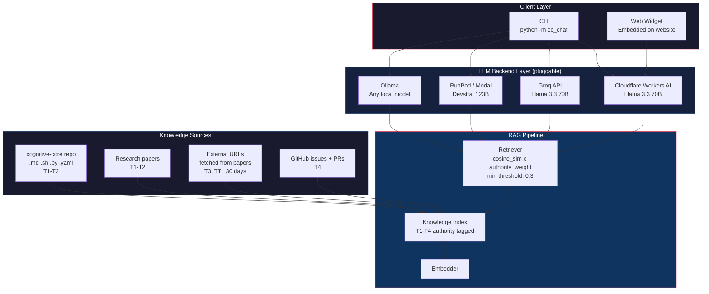
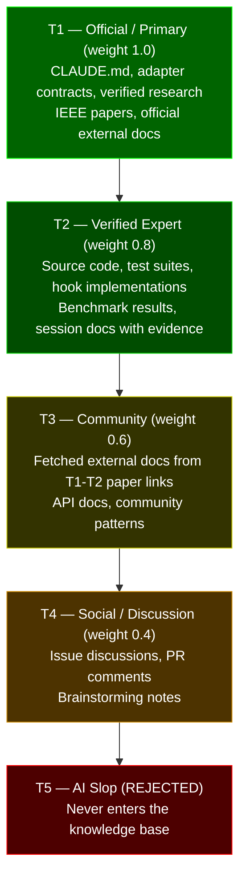
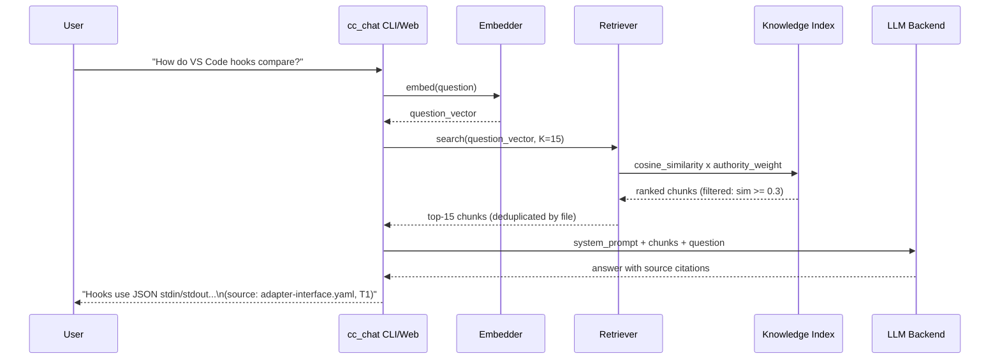
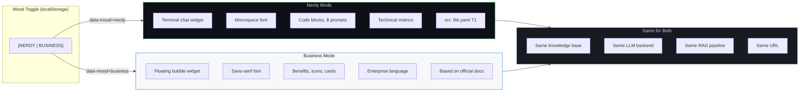
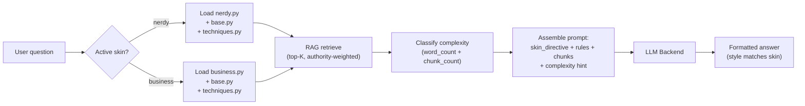

# Design Study: cognitive-core Assistant — Authority-Weighted RAG Chatbot

**Date**: 2026-03-24
**Issue**: [mindcockpit-ai/cognitive-core#141](https://github.com/mindcockpit-ai/cognitive-core/issues/141)
**Status**: Complete (v5.0, peer-reviewed)
**Contributors**: solution-architect (architecture review), research-analyst (sources, methodology)

---

## Executive Summary

A cognitive-core assistant chatbot using authority-weighted RAG over the full repository, deployable as CLI tool and embeddable web widget. The assistant adapts its personality via a dual-mood UI (nerdy terminal + business bubble) with skin-aware prompt engineering.

**Key innovations**:
1. **Authority-weighted RAG** — chunks scored by `semantic_similarity x authority_weight` using the cognitive-core Source Authority Model (T1-T5)
2. **Dual-mood UI** — same knowledge base, two presentation modes (terminal + bubble)
3. **Skin-aware prompts** — the LLM's output style adapts per mood, not just CSS
4. **Shared prompt library** — empirically proven techniques reused across assistant and skills

---

## Table of Contents

1. [Architecture](#1-architecture)
2. [Authority-Weighted Knowledge Base](#2-authority-weighted-knowledge-base)
3. [RAG Pipeline](#3-rag-pipeline)
4. [Dual-Mood UI](#4-dual-mood-ui)
5. [Skin-Aware Prompt Architecture](#5-skin-aware-prompt-architecture)
6. [Component Design](#6-component-design)
7. [Open Source Assessment](#7-open-source-assessment)
8. [Peer Review Summary](#8-peer-review-summary)

---

## 1. Architecture

The assistant uses a pluggable backend architecture — any LLM provider can be swapped in via a ~30-line adapter class (same pattern as cognitive-core's platform adapters).



### Deployment Modes

| Mode | Backend | User | Install |
|------|---------|------|---------|
| **CLI** | Any cloud or local | Developer using cognitive-core | `python -m cc_chat` |
| **Web widget** | Cloud provider | Website visitor | Embedded component |
| **Standalone** | Cloud provider | Developer evaluating | `pip install cognitive-core-chat` |
| **Local** | Ollama | Developer with own hardware | `cc-chat --backend ollama` |

### Backend Abstraction

```python
class LLMBackend:
    def chat(self, messages: list[dict], system: str) -> str: ...

class CloudflareBackend(LLMBackend):    # Cloud, free tier available
class GroqBackend(LLMBackend):          # Cloud, fastest
class RunPodBackend(LLMBackend):        # Serverless GPU, big models
class OllamaBackend(LLMBackend):        # Local hardware
```

---

## 2. Authority-Weighted Knowledge Base

The knowledge base applies cognitive-core's [Source Authority Model](source-authority-model.md) to every chunk. This is the core differentiator — no other AI framework assistant weights its knowledge by source quality.

### Knowledge Pyramid



### Knowledge Sources

| Source | Tier | Content |
|--------|------|---------|
| CLAUDE.md, adapter-interface.yaml | T1 | Framework contracts, key rules |
| Skill SKILL.md files | T1 | Skill descriptions, usage, tools |
| Agent .md files | T1 | Agent roles, capabilities |
| Research papers | T1 | Architecture analysis, benchmarks |
| Source code (adapter.sh, generate.py, hooks) | T2 | Implementation patterns |
| Test suites | T2 | Test patterns, assertions |
| Recipes, session docs | T2 | How-to guides, decisions |
| Linked external URLs (from T1-T2 papers) | T3 | VS Code docs, API docs, academic papers |
| GitHub issues + PR discussions | T4 | Context, decisions, rationale |

### Link Following Pipeline

Research papers contain verified URLs. These are curated T3 knowledge:

1. Parse all `.md` files for URLs
2. Filter: only URLs from T1-T2 rated papers
3. Fetch + cache content (robots.txt respected)
4. TTL: 30 days — re-fetch on expiry, skip gracefully on failure
5. Chunk with metadata: `{file, section, url, tier: T3, fetched_date}`
6. Embed and index alongside repo content

---

## 3. RAG Pipeline



### Relevance Scoring

```
final_score = semantic_similarity x authority_weight
```

A T1 chunk at 0.8 similarity outranks a T4 chunk at 0.95 similarity.

**Minimum similarity threshold**: 0.3. Below this, the assistant responds "I don't have enough information" rather than serving low-relevance content.

**Deduplication**: If multiple chunks from the same file are retrieved, keep only the highest-scoring.

### Context Window Budget (per request)

| Component | Tokens |
|-----------|--------|
| System prompt | ~300 |
| Retrieved chunks (K=15) | ~3,000 |
| User question | ~100 |
| Conversation history (CLI, last 3 turns) | ~1,500 |
| Response budget | ~1,000 |
| **Total** | **~6,000** |

---

## 4. Dual-Mood UI

The website supports two presentation modes, toggled by the user. Same content, same knowledge base, different personality.



### What Changes Per Mode

| Element | Nerdy Mode | Business Mode |
|---------|------------|---------------|
| **Chat widget** | Terminal (monospace, `$ >` prompt, green-on-dark) | Floating bubble (rounded, brand colors) |
| **Citations** | `src: adapter-interface.yaml (T1)` | `Based on official documentation` |
| **Hero text** | "4 adapters, 20 skills, 10 agents, 18 test suites" | "AI governance for your development team" |
| **Install** | `bash install.sh /your/project` | "Get started in 5 minutes" button |
| **Features** | Adapter contracts, hook protocol, test suites | Security guard, quality gates, multi-platform |

### Implementation

```html
<body data-mood="business">  <!-- or "nerdy", persisted in localStorage -->
```

Both versions exist in the HTML — CSS shows/hides. Same page, same URL, zero content duplication. Toggle uses `role="switch"` + `aria-checked` for accessibility. Terminal theme verified for WCAG AA contrast (4.5:1 minimum).

---

## 5. Skin-Aware Prompt Architecture

The system prompt adapts per mood — not just CSS, but the LLM's output style changes too.

### Prompt Techniques (empirically proven)

| Technique | Source | Applied How |
|-----------|--------|-------------|
| Least-to-Most decomposition | Zhou et al. 2022 | Multi-step answers broken into sequential sub-answers |
| Position-aware layout | Liu et al. 2024 | Critical constraints at beginning AND end of prompt |
| Direct imperative mood | Yin et al. 2024 | No hedging, no politeness tokens |
| Specification > cleverness | Empirical finding, 2025 | Authority-grounded answers over creative generation |

### Nerdy Skin Directive

```markdown
You are cognitive-core CLI. Output in terminal style.
- Use code blocks for commands, file paths, config snippets
- Show full source citations: `src: {file_path}:{line} ({tier})`
- Use technical vocabulary: hooks, adapters, RAG, MCP, POSIX
- Command first, explanation after
```

### Business Skin Directive

```markdown
You are the cognitive-core assistant — a helpful guide for AI-powered development.
- Use plain language, translate jargon: "hooks" -> "safety checks"
- Show simplified citations: "Based on official documentation"
- Explain the benefit first, then the steps
- Use bullet points for multi-step instructions
```

### Complexity Dispatch

Answer depth adapts to question complexity:

| Complexity | Detection | Nerdy | Business |
|------------|-----------|-------|----------|
| **Simple** | Short question, few retrieved chunks | 2-line answer + file ref | 3-line benefit + action |
| **Moderate** | Multi-part, 4-8 chunks | Code example + flow | Step-by-step + analogy |
| **Complex** | Architecture-level, 8+ chunks | Comparison table + refs | Feature matrix + business impact |

### Runtime Flow



---

## 6. Component Design

**Repository**: Separate — `cognitive-core-chat` (per CLAUDE.md: Python in core is "adapters only")

```
cognitive-core-chat/
  cc_chat/
    __init__.py
    __main__.py                    # Entry: python -m cc_chat
    cli.py                         # REPL loop with skin selection
    backends/
      base.py                      # LLMBackend abstract class
      cloudflare.py                # ~30 lines
      groq.py                      # ~30 lines
      runpod.py                    # ~40 lines
      ollama.py                    # ~30 lines
    rag/
      chunker.py                   # Repo -> chunks with tier metadata
      embedder.py                  # Embed via provider API
      retriever.py                 # Cosine similarity with authority weighting
      link_follower.py             # Fetch + cache external URLs
    prompts/
      base.py                      # Authority grounding, RAG injection
      nerdy.py                     # Terminal-style directives
      business.py                  # Business-style directives
      techniques.py                # Empirical techniques (shared with #140)
      complexity.py                # S/M/L dispatch (shared with #140)
    knowledge.py                   # Load knowledge-index.json
  tools/
    build-knowledge-base.py        # CLI: generate index from repo
  web/
    CognitiveChat.astro            # Astro component wrapper
    chat-widget.ts                 # Vanilla JS (no React)
    api/chat.ts                    # Astro API route
```

**Dependencies**: Python 3.11+ stdlib only (`urllib.request`, `json`, `math`, `argparse`, `pathlib`). No numpy, no external packages.

---

## 7. Open Source Assessment

### Adopt > Adapt > Build (cognitive-core Research-First Principle)

| Solution | Embeddable Widget? | Authority-Weighted RAG? | Dual-Mood? | Verdict |
|----------|-------------------|------------------------|------------|---------|
| Open WebUI | No (Docker) | No | No | CLI complement for power users |
| LobeChat | Partial | No | No | Could serve as backend |
| LibreChat | No | No | No | Too heavy |
| **Custom build** | **Yes** | **Yes** | **Yes** | **Best fit** |

**Decision**: Build custom. No existing solution supports the combination of embeddable web widget + authority-weighted RAG + skin-aware prompts + zero Python dependencies.

---

## 8. Peer Review Summary

The full feasibility study underwent 3 rounds of peer review:

| Round | Reviewers | Verdict | Issues Found | Issues Fixed |
|-------|-----------|---------|-------------|-------------|
| 1 | solution-architect, research-analyst | FAIL / WARN | 7 MAJOR, 19 MINOR | 7 MAJOR, 15 MINOR |
| 2 | research-analyst | PASS (5 MINOR) | 0 MAJOR, 5 MINOR | 5 MINOR |
| 3 | research-analyst | PASS (3 WARN) | 0 MAJOR, 3 WARN | 3 WARN |

Key corrections from peer review:
- Cost model recalculated using neuron-based pricing (not request-based)
- Authority weights aligned with canonical Source Authority Model
- Component counts verified against actual repo (10 agents, 20 skills)
- RAG pipeline sequencing fixed (retrieve before classify)
- Cross-repo sharing mechanism specified for prompt library
- Accessibility requirements added for dual-mood toggle

---

## References

| Source | Rating |
|--------|--------|
| cognitive-core Source Authority Model | T1 |
| Cloudflare Workers AI documentation | T1 |
| Zhou et al. 2022 — Least-to-Most Prompting (ICLR 2023) | T1 |
| Liu et al. 2024 — Lost in the Middle (TACL) | T1 |
| Yin et al. 2024 — Prompt style effects on LLMs | T1 |
| Specification quality over prompt cleverness (empirical finding, 2025) | T2 |
| Local LLM benchmark (internal testing) | T2 |
| Open WebUI, LobeChat, LibreChat (official repos) | T1 |
