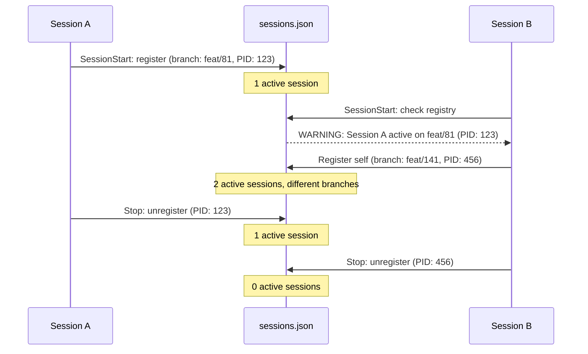

# Research: Inter-Session Coordination for AI Coding Assistants

**Research Type**: Feasibility (per #135 Research Methodology Framework)
**Date**: 2026-03-24
**Issue**: [mindcockpit-ai/cognitive-core#144](https://github.com/mindcockpit-ai/cognitive-core/issues/144)
**Status**: Complete
**Contributors**: research-analyst (patterns survey), solution-architect (design review)

---

## Executive Summary

Claude Code has native worktree isolation (`--worktree` flag, v2.1.49+) that solves filesystem conflicts between concurrent sessions. However, no AI coding tool provides **inter-session coordination** — shared state, task deconfliction, or progress awareness. The gap between "isolated filesystems" and "coordinated work" is where cognitive-core adds value.

**Recommendation**: `mkdir`-based advisory lock + JSON session registry + SessionStart/Stop hooks.

---

## 1. Research Questions

| # | Question | Answer |
|---|----------|--------|
| RQ1 | Does Claude Code have built-in session coordination? | Worktree isolation yes, coordination no |
| RQ2 | Do other AI tools coordinate concurrent sessions? | No tool has runtime coordination |
| RQ3 | What is the simplest reliable lock pattern for shell? | `mkdir` (POSIX atomic, portable) |
| RQ4 | Can git worktrees serve as full session isolation? | Yes, Claude Code already supports this |
| RQ5 | What coordination layer is missing? | Session registry + task awareness + merge orchestration |

---

## 2. Current State Analysis

### Claude Code Built-In Support

| Feature | Status | Details |
|---------|--------|---------|
| Worktree isolation | Built-in (v2.1.49+) | `--worktree` flag creates separate working directory + branch |
| Subagent isolation | Built-in | Subagents get own worktrees, auto-cleaned if no changes |
| Tmux integration | Built-in | `--tmux` launches session in its own tmux pane |
| Session locking | **None** | No lock mechanism between sessions |
| Task deconfliction | **None** | Sessions are unaware of each other's work |
| Shared progress state | **None** | No way for Session A to know Session B's status |

### Other AI Coding Tools

| Tool | Multi-Session | Coordination |
|------|--------------|--------------|
| Claude Code | Yes (worktrees) | None |
| Cursor | Yes (multi-window) | None |
| Copilot Workspace | Yes (parallel plans) | Partial (cloud-based plan visibility) |
| Cline | Yes (multi-instance) | None |
| Aider | No native | None |

### Notable Community Tools

| Tool | Purpose | Source |
|------|---------|--------|
| **CCManager** | Multi-tool session manager (Claude, Gemini, Codex, Cursor, Cline). Manages worktrees and PTY sessions. | github.com/kbwo/ccmanager (T2) |
| **cli-continues** | Cross-tool handoff (182 paths across 14 tools). Generates handoff documents. | github.com/yigitkonur/cli-continues (T2) |

**Key insight**: No tool has runtime coordination (lock/claim/notify). All solve isolation, none solve collaboration.

---

## 3. Lock Patterns (Shell/Filesystem)

### Pattern Comparison

| Pattern | Atomic? | Auto-Release on Crash? | macOS? | Linux? | Stale Risk |
|---------|---------|----------------------|--------|--------|------------|
| **`mkdir`** | Yes (POSIX guarantee) | No (needs trap + PID check) | Yes | Yes | Medium (mitigated) |
| **`flock(1)`** | Yes (kernel-managed) | Yes (auto on process death) | **No** (not available) | Yes | None |
| **PID file** | No (race condition) | No | Yes | Yes | High |

### Recommended: `mkdir` Lock with PID Validation

```bash
LOCKDIR="${PROJECT_DIR}/.claude/session.lock.d"

acquire_lock() {
    if mkdir "$LOCKDIR" 2>/dev/null; then
        echo "$$" > "$LOCKDIR/pid"
        echo "$(date -Iseconds)" > "$LOCKDIR/started"
        trap 'rm -rf "$LOCKDIR"' EXIT
        return 0
    fi

    # Lock exists — check if stale
    local lock_pid
    lock_pid=$(cat "$LOCKDIR/pid" 2>/dev/null || echo "0")
    if ! kill -0 "$lock_pid" 2>/dev/null; then
        # Process dead — stale lock
        rm -rf "$LOCKDIR"
        mkdir "$LOCKDIR" 2>/dev/null && return 0
    fi

    return 1  # Another active session
}
```

**Why `mkdir`**: It is the only POSIX-guaranteed atomic filesystem operation that works on both macOS and Linux without additional tools. `flock(1)` is superior but not available on macOS without Homebrew.

---

## 4. Proposed Architecture

### Session Registry (`.claude/sessions.json`)

```json
{
  "sessions": [
    {
      "id": "session-1711302600",
      "started": "2026-03-24T18:30:00+01:00",
      "branch": "feat/81-vscode-adapter",
      "description": "VS Code adapter implementation",
      "pid": 12345,
      "worktree": null
    }
  ]
}
```

### Hook Integration

```
SessionStart hook (session-guard.sh):
  1. Read sessions.json
  2. Clean stale entries (PID dead or >2h old)
  3. If active sessions exist: WARN (not block)
  4. Add own session to registry
  5. Write lock dir

Stop hook (session-cleanup.sh):
  1. Remove own session from registry
  2. Remove lock dir
```

### Coordination Flow



### Branch Convention

| Rule | Rationale |
|------|-----------|
| Each session works on its own branch | Prevents file-level conflicts |
| `main` only touched for merges | Merge is a deliberate, coordinated action |
| Branch name includes issue number | Easy to identify session purpose |
| Session guard warns if two sessions share a branch | Highest conflict risk |

---

## 5. Comparison of Approaches

| Approach | Isolation | Awareness | Coordination | Effort | Fit |
|----------|-----------|-----------|-------------|--------|-----|
| **Do nothing** | None | None | None | 0 | Bad |
| **Worktrees only** (`claude --worktree`) | Full | None | None | 0 | Partial |
| **Lock file only** | None | Conflict warning | None | Low | Minimal |
| **Lock + Registry** (proposed) | Optional (worktree) | Full (session list) | Warning-based | Low | **Best fit** |
| **Full coordination** (task claiming, merge orchestration) | Full | Full | Active | High | Overkill for now |

---

## 6. Implementation Plan

### Phase 1: Session Guard Hook (4h)
- `session-guard.sh` — SessionStart hook
- `session-cleanup.sh` — Stop hook
- `mkdir`-based lock with PID validation
- `sessions.json` registry (read/write)
- Stale session cleanup (>2h or dead PID)
- `.claude/session.lock.d` added to `.gitignore`
- `.claude/sessions.json` added to `.gitignore`

### Phase 2: Branch Awareness (2h)
- Warn if two sessions share the same branch (highest risk)
- Suggest `--worktree` when conflict detected
- Display active sessions with branch + description

### Phase 3: Documentation + Tests (2h)
- Document branch convention in CLAUDE.md
- Add test coverage to hook test suite
- Test: concurrent session detection, stale cleanup, PID validation

---

## 7. Evaluation

| Criterion | Weight | Score | Evidence |
|-----------|--------|-------|----------|
| Solves the observed problem | 30% | HIGH | CLAUDE.md overwrite incident triggered this |
| Portable (macOS + Linux) | 25% | HIGH | `mkdir` is POSIX, JSON is stdlib |
| Low maintenance | 20% | HIGH | Two hooks, ~60 lines total |
| Non-blocking | 15% | HIGH | Warns, never blocks |
| Extensible to full coordination | 10% | HIGH | Registry supports future task claiming |
| **Overall** | 100% | **GO** | **Confidence: 90%** |

---

## References

| Source | Rating | Used For |
|--------|--------|----------|
| Claude Code Worktree Docs | T1 | Built-in `--worktree` capability |
| Git Worktree Documentation | T1 | Isolation model, limitations |
| `flock(1)` Linux Man Page | T1 | Lock pattern comparison |
| POSIX `mkdir` atomicity guarantee | T1 | Lock pattern selection |
| File Locking in Linux (Baeldung) | T2 | Lock pattern survey |
| CCManager (github.com/kbwo/ccmanager) | T2 | Multi-tool session management |
| cli-continues (github.com/yigitkonur/cli-continues) | T2 | Cross-tool handoff patterns |
| VS Code Multi-Window Architecture | T2 | File watcher conflict model |
| cognitive-core session-sync skill | T2 | Existing cross-machine sync (complement) |
